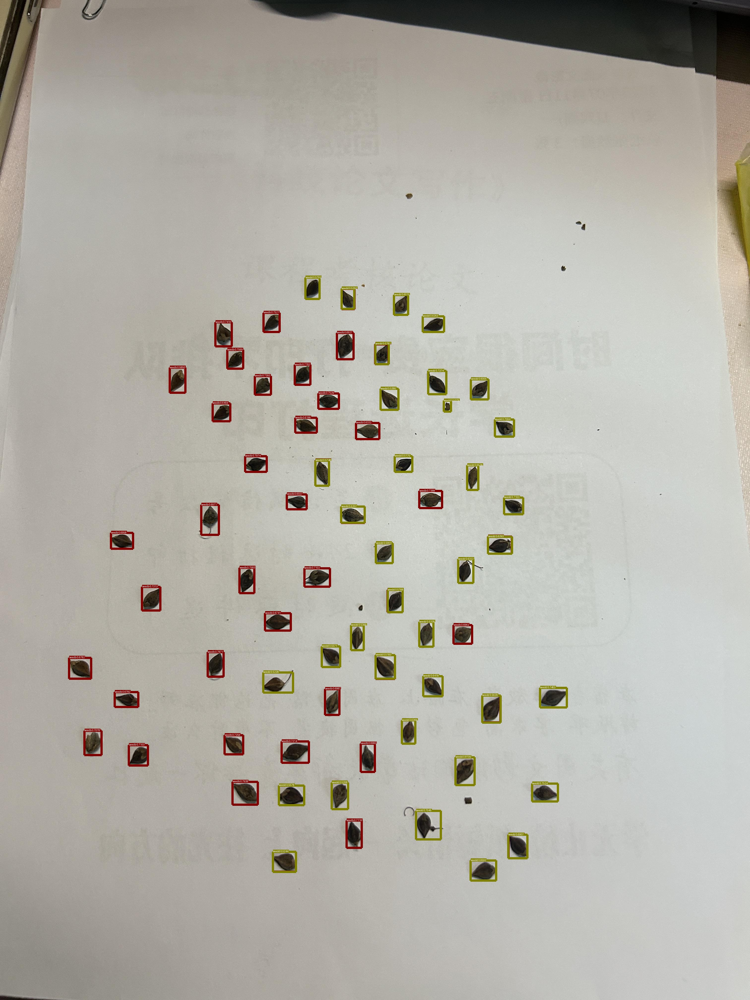
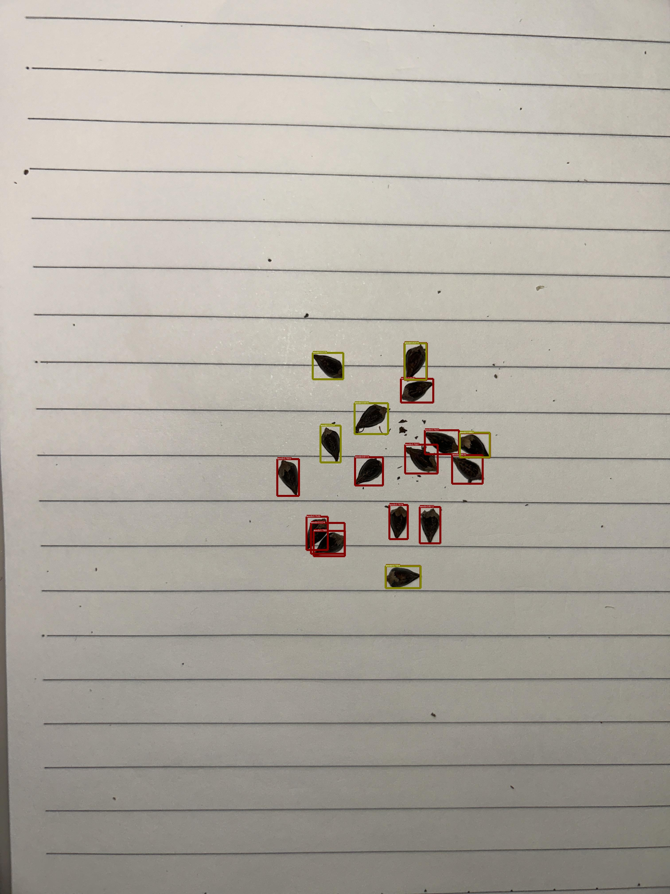
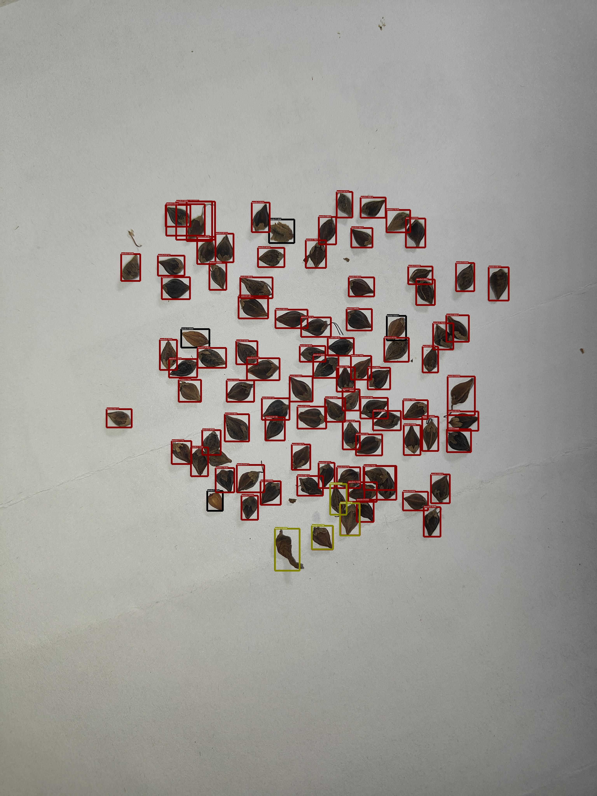
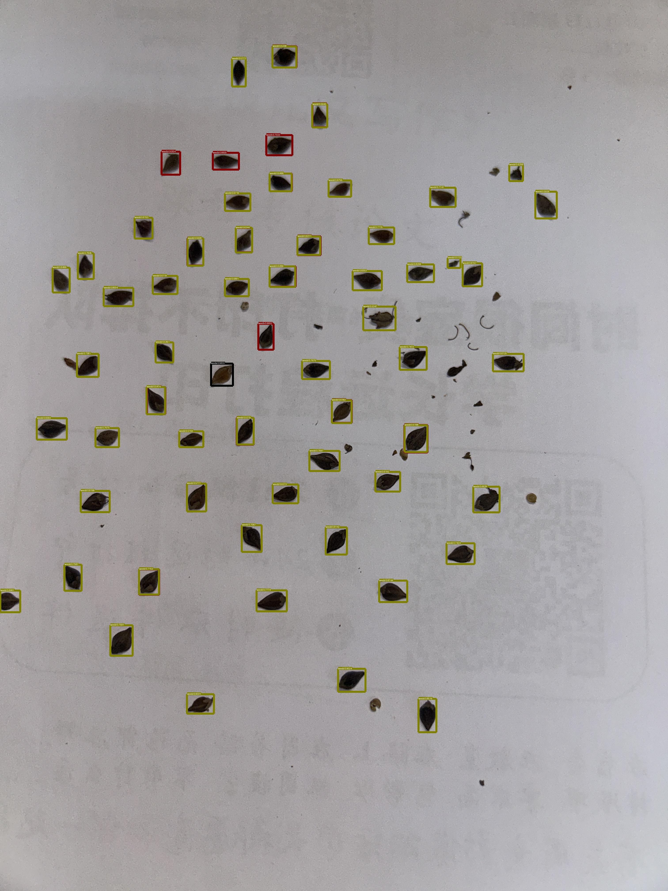
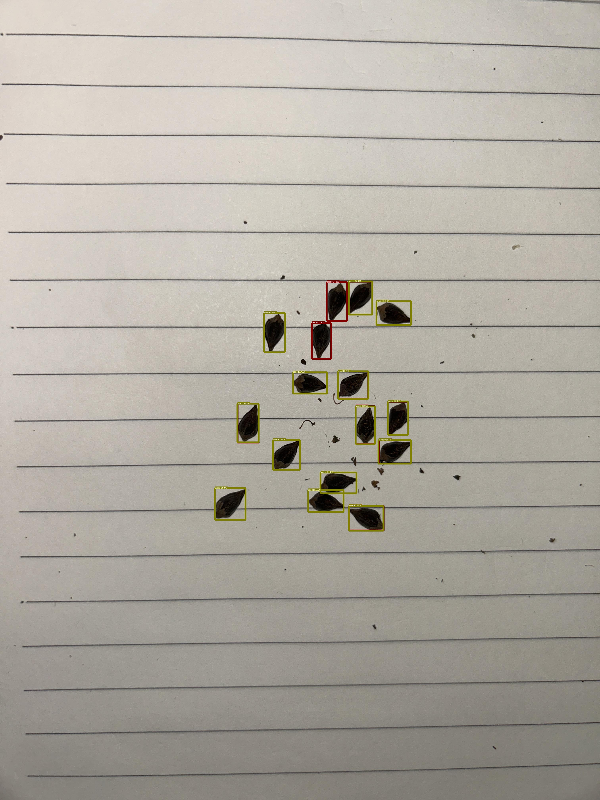
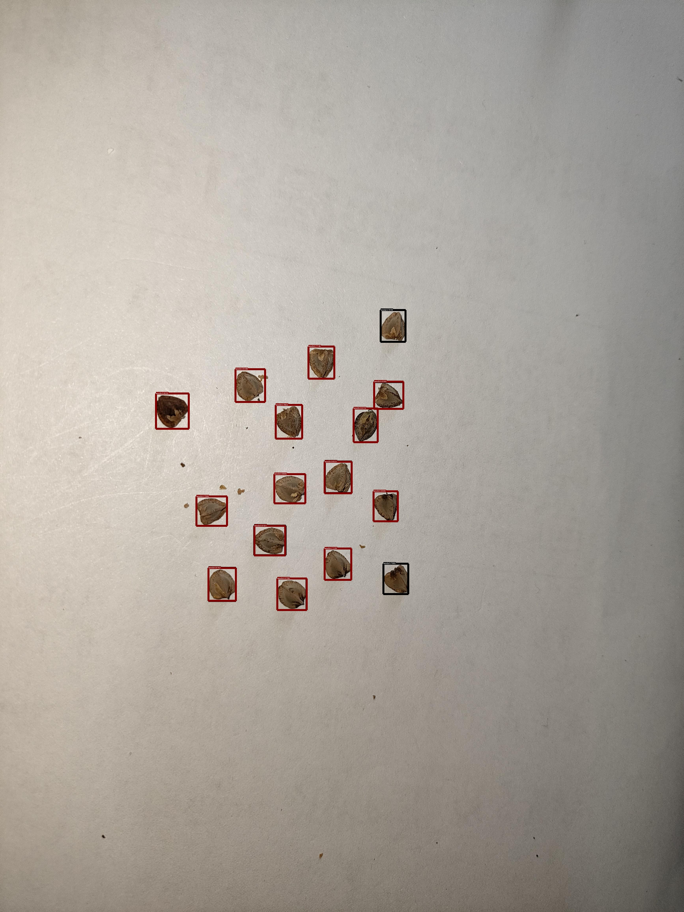

# Buckwheat Seed Quality Detection

> 项目继承并遵循 [Apache-2.0](LICENSE) 许可，核心检测模型来自 PaddleDetection 的 **PP-YOLOE+ (L)**。在此基础上，我们针对荞麦籽的批量质检引入了小目标优化、自适应学习率实验以及桌面端推理工具。

## 📌 项目概览

- **检测对象**：在高分辨率背景中识别并评估荞麦籽粒是否饱满、是否夹杂杂质。
- **模型基础**：PP-YOLOE+ (L) + CRN Backbone，保持 800×800 的输入分辨率，辅以我们自研的批量标注和数据增强流程。
- **优化要点**：
  - 自适应学习率（余弦退火 + Restart）与阶段性恢复训练，日志记录在 `quality_optimized_training_*.log`、`accelerated_training_*.log`、`balanced_restart_*.log` 中。
  - 结合 `app/ui.py` 的 letterbox/拉伸双通道预处理与后处理修正，确保摄像头实时框与原图对齐。
  - 提供 `logs_analysis/` 解析脚本，将训练日志转化为 `training_metrics.csv` 与可视化图表，便于调参复盘。
  - 改进路线图：《[Buckwheat Improvement Roadmap](Buckwheat_Improvement_Roadmap.md)》滚动维护训练/部署迭代计划。
- **可视化工具**：`python app/main.py` 启动桌面端推理，自动检测 GPU 可用性，支持摄像头、单图/批量图片检测、置信度调节与缩放操作。

## 🖼️ 批量标注示例

以下示例来自 `inference_results/archive/ppyoloe_plus_postprocess_fix/`，该目录收录了 Readme 文档正在使用的对齐后可视化成果：

|  |  |  |
| --- | --- | --- |
| test-001 | test-015 | test-030 |

|  |  |  |
| --- | --- | --- |
| test-033 | test-040 | test-044 |

> 温馨提示：`inference_results/showcase/` 目前为空，全部可复用素材已经迁移至 `inference_results/archive/ppyoloe_plus_postprocess_fix/`，其中保留了模型修正后的最终输出。

> **Readme 文档素材**：为方便撰写说明书/汇报文档，`inference_results/archive/ppdet_official/` 目录保留了 45 张 PaddleDetection 官方可视化输出，可直接引用到 Readme 文档中（本仓库已纳入版本控制，无需额外导出）。示例：

## 🚀 快速开始

```powershell
# 1) 安装 PaddlePaddle（推荐 GPU 版，需满足本地 CUDA 环境）
python -m pip install paddlepaddle-gpu==3.1.0 -i https://mirror.baidu.com/pypi/simple

# 2) 安装 PaddleDetection 依赖
pip install -r PaddleDetection/requirements.txt

# 3) 启动桌面推理应用
python app/main.py
```

- 批量推理：推荐使用 `python -m app.batch_infer --input-dir inference_results/raw --output-dir inference_results/showcase`，与桌面应用保持一致的可视化效果；如需脚本级过滤，可继续使用 `tools/run_inference_on_dataset.py`。
- 训练恢复：`bash train_quality_optimized.sh`（自动检测最新 checkpoint 并继续运行 300 epoch 计划）。
- 日志解析：`python logs_analysis/parse_training_logs.py` 生成 `logs_analysis/training_metrics.csv` 与对照图。

## 📊 指标小结

| 策略 | 数据来源日志 | 最佳 epoch | AP@[0.5:0.95] | AP@0.5 | 备注 |
| --- | --- | --- | --- | --- | --- |
| Quality Optimized | `quality_optimized_training_20250919_18xxxx.log` | 159 | 0.167 | 0.204 | 指标来自 `logs_analysis/training_metrics.csv`；`max_mem_reserved` ≈ 22.6 GB |
| Accelerated Restart | `accelerated_training_20250919_175406.log` | 待补评估 | — | — | 需运行 `python tools/eval.py` 生成验证指标 |
| Balanced Restart | `balanced_restart_training_20250919_174427.log` | 待解析 | — | — | 日志已归档，计划纳入 `logs_analysis` 脚本 |

> 解析脚本：`python logs_analysis/parse_training_logs.py` 会生成 `training_metrics.csv`、`training_loss.png` 与 `training_ap.png`，便于对照调参。
> 设计思路：路线图中的“小样本分层动态学习率方案（2025-10-03）”详细记录迁移学习、分层学习率与抖动响应的实现细节。
> **重要提示（2025-10-03）**：租用训练服务器已到期，部分原始日志与模型文件未能完整保存，运行新实验前请确认 checkpoint 及评估结果是否齐全。

## 📜 许可与致谢

- 本项目沿用 Apache-2.0 许可，新增脚本与 UI 组件亦采用同一协议。
- 感谢 PaddleDetection 官方仓库提供的 PP-YOLOE+ 基线与导出工具；本项目的增量优化集中于小目标检测、实时推理 UI、日志分析等环节。
- 本项目基于 [PaddleDetection](https://github.com/PaddlePaddle/PaddleDetection) 进行二次开发，主要改动包含数据集构建、训练调优、推理 UI 与日志解析等功能；如在下游项目中使用本仓库，请保留上述署名信息。

---
简体中文 | [English](README_en.md)
